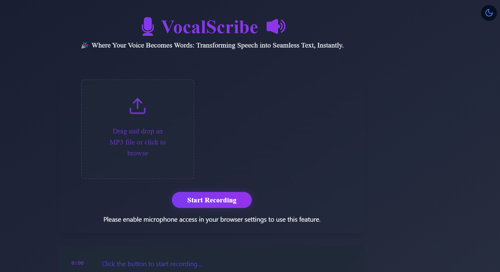
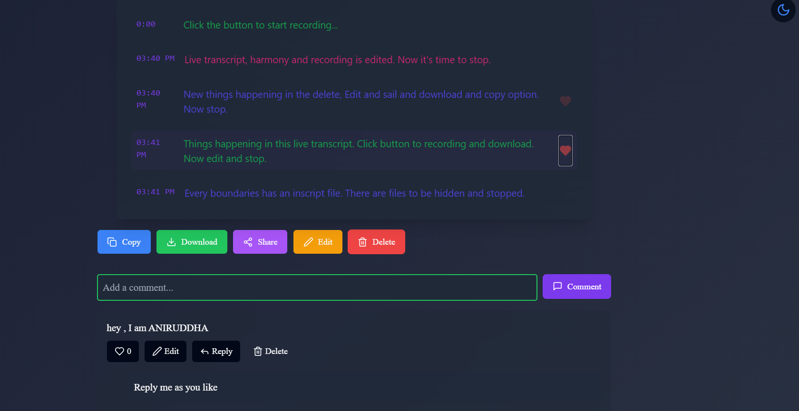

# **VocalScribe - Where Your Voice Becomes Words**

**VocalScribe** is a modern web application that provides real-time audio transcription with a beautiful and interactive user interface. Built with **React**, **TypeScript**, and **Tailwind CSS**, it offers a seamless experience for converting speech to text. Whether you want to upload an **.mp3** file or speak directly into the app, **VocalScribe** makes transcribing your words easy and engaging.





---

## **Features**

- 🎙️ **Real-time Audio Recording and Transcription**: Speak directly into the app to instantly get transcriptions.
- 📁 **Audio File Upload**: Upload an **.mp3** file to generate accurate transcriptions.
- 🖋️ **Editable Transcriptions**: Edit, delete, and like transcriptions.
- 📋 **Copy and Download**: Easily copy the transcript or download it as a text file.
- 💬 **Interactive Comments**: Leave comments, reply to others, like comments, and edit or delete them.
- ❤️ **Like and Comment on Transcripts**: Engage with the generated transcriptions through likes and comments.
- 🌈 **Dark/Light Mode**: Switch between dark and light themes to suit your preferences.
- 🌟 **Animated Backgrounds and Transitions**: Smooth animations that enhance the user experience.
- 📱 **Full Responsive Design**: Optimized for all devices for a seamless experience.
- 📤 **Share on Social Media**: Share your transcriptions directly on Facebook, Twitter, or LinkedIn.

---

## **Tech Stack**

- **Frontend**:
  - React 18
  - TypeScript
  - Tailwind CSS
  - Shadcn/UI components
  - React Router DOM
- **Backend**:
  - **AssemblyAI** API for transcription
- **Other Tools**:
  - Tanstack Query for data fetching
  - Smooth animations for UI transitions

---

## **Getting Started**

### Prerequisites

- Node.js 16.x or higher
- npm or yarn package manager

### Installation

1. Clone the repository:
   ```bash
   git clone https://github.com/yourusername/vocalscribe.git
   cd vocalscribe
   ```

2. Install dependencies:
   ```bash
   npm install
   # or
   yarn install
   ```

3. Create a `.env` file in the root directory and add your **AssemblyAI API** key:
   ```env
   VITE_ASSEMBLY_AI_API_KEY=your_api_key_here
   ```

4. Start the development server:
   ```bash
   npm run dev
   # or
   yarn dev
   ```

5. Open [http://localhost:5173](http://localhost:5173) in your browser.

---

## **Usage**

1. **Upload Audio File**: Click the "Upload" button or drag and drop an audio file to start transcription.
2. **Speak to Transcribe**: Use the microphone button to speak and get real-time transcription.
3. **View Transcription**: The generated transcription will appear with timestamps.
4. **Interact with Transcriptions**: Like, comment, edit, or delete transcriptions.
5. **Dark/Light Mode**: Toggle between light and dark themes to suit your needs.
6. **Social Media Sharing**: Share your transcription on Facebook, Twitter, or LinkedIn.
7. **Download or Copy**: Download or copy the transcript to use elsewhere.

---

## **Project Structure**

```
src/
  ├── components/        # React components
  ├── pages/            # Page components
  ├── utils/            # Utility functions
  ├── hooks/            # Custom React hooks
  ├── lib/              # Library configurations
  └── App.tsx           # Main application component
```

---

## **Contributing**

1. Fork the repository.
2. Create your feature branch (`git checkout -b feature/AmazingFeature`).
3. Commit your changes (`git commit -m 'Add some AmazingFeature'`).
4. Push to the branch (`git push origin feature/AmazingFeature`).
5. Open a Pull Request.

---

## **License**

This project is licensed under the MIT License - see the [LICENSE](LICENSE) file for details.

---

## **Acknowledgments**

- [AssemblyAI](https://www.assemblyai.com/) for providing the transcription API.
- [Shadcn/UI](https://ui.shadcn.com/) for the beautiful component library.
- [Tailwind CSS](https://tailwindcss.com/) for the utility-first CSS framework.

---

## **Contact**

**Aniruddha Adak**  
📧 [aniruddhaadak80@gmail.com](mailto:aniruddhaadak80@gmail.com)  
📱 [+917029155691](tel:+917029155691)  

Project Link: [https://github.com/yourusername/vocalscribe](https://github.com/yourusername/vocalscribe)
